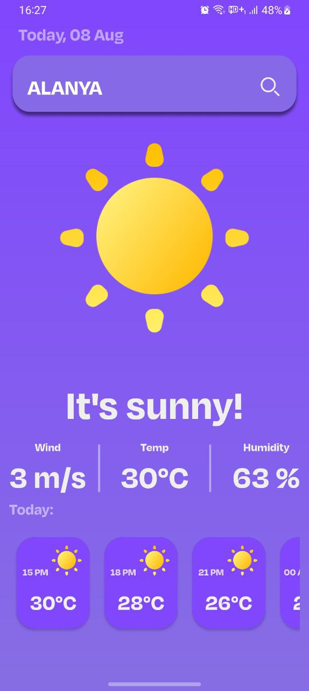

## WEATHER APP 
________________________________________
### 🚀 The project uses the following technologies: 
#### - Java
#### - RxJava 
#### - Retrofit 
### 🛠 Architecture: 
#### - MVVM

________________________________________

